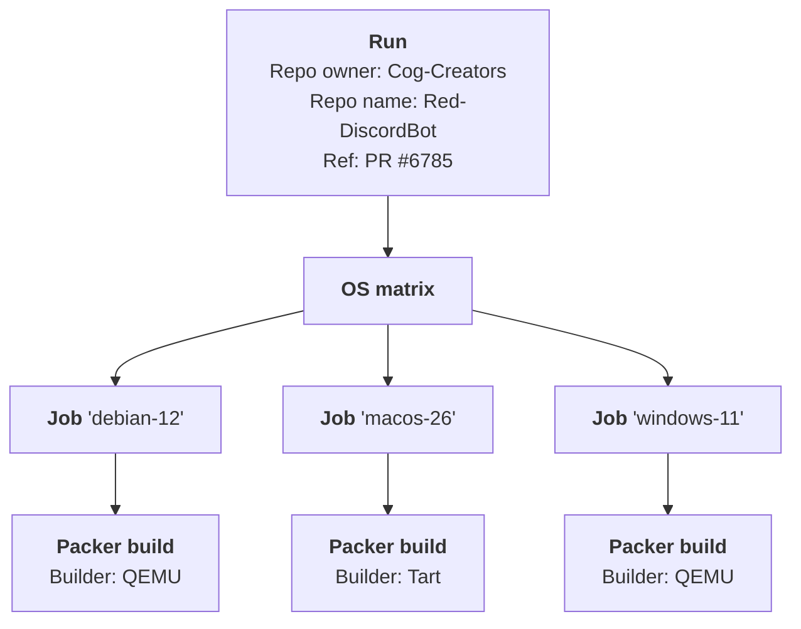

# Red-Install-Tests

The CI setup for running Red's [current stable installation instructions](https://docs.discord.red/en/stable/install_guides/index.html)
and [installation instructions from `V3/develop` branch](https://docs.discord.red/en/latest/install_guides/index.html) daily.

This repo also allows for requesting builds for pending PRs on demand.

## Pre-requirements

- Python 3.10
- [Hatch](https://hatch.pypa.io/latest/install/)
- [QEMU](https://www.qemu.org/download/)
- On Linux, you might need to manually install [xorriso](https://www.gnu.org/software/xorriso/)

## Supported platforms

<table>
    <thead>
        <tr>
            <th rowspan=2>Host OS</th>
            <th colspan=4>Guest OS</th>
        </tr>
        <tr>
            <th scope="col">Linux x86_64</th>
            <th scope="col">Linux aarch64</th>
            <th scope="col">macOS aarch64</th>
            <th scope="col">Windows x86_64</th>
        </tr>
    </thead>
    <tbody align="center">
        <tr>
            <th scope="row">Linux x86_64</th>
            <td>✅<br><b>recommended</b> host</td>
            <td>⚠️<br>emulation-only</td>
            <td>❌</td>
            <td>✅<br><b>recommended</b> host</td>
        </tr>
        <tr>
            <th scope="row">Linux aarch64</th>
            <td>⚠️<br>emulation-only</td>
            <td>✅<br><b>recommended</b> host</td>
            <td>❌</td>
            <td>⚠️<br>emulation-only</td>
        </tr>
        <tr>
            <th scope="row">macOS aarch64</th>
            <td>⚠️<br>emulation-only</td>
            <td>✅<br>accelerated</td>
            <td>✅<br><b>recommended</b> host</td>
            <td>⚠️<br>emulation-only</td>
        </tr>
        <tr>
            <th scope="row">Windows x86_64</th>
            <td>✅<br>accelerated</td>
            <td>⚠️<br>emulation-only</td>
            <td>❌</td>
            <td>✅<br>accelerated</td>
        </tr>
    </tbody>
</table>

## Terminology

-   **run** - a build configuration with one or more **jobs**,
    a **run directory** consists of a run configuration file (`run_config.json`),
    a Red repository directory, and an OS matrix (`os_matrix.json`).
    When the run consists of only one job, it may be used as the **job directory**.
-   **job** - a single OS build configuration corresponding to one [Packer](https://developer.hashicorp.com/packer) build,
    a **job directory** consists of files from the **run directory** and a job configuration file (`job_config.json`)
-   **build** - a [Packer](https://developer.hashicorp.com/packer) build for a **job**,
    a **build directory** consists of all files needed for the Packer build such as `*.pkr.hcl` template files,
    `*.pkrvars.json` variable files, or the OS base image file.



## Running locally

> [!NOTE]
> By default, the **run directory** will be the `os-build-run` subdirectory of the current directory.
> All commands that work on a run directory allow you to provide a different directory
> with the `--run-dir` option:
> ```console
> hatch run red-install-tests configure-run --run-dir path/to/run-directory
> ```
> When using project's Hatch scripts (e.g. `hatch run configure-run` instead of
> `hatch run red-install-tests configure-run`), the **run directory** will be
> the `os-build-run` subdirectory of the project root rather than of the current directory.
>
> The shortcut scripts `generate-bare-run`, `generate-job`, `generate-jobs`, and `generate-run`
> do not allow customizing directories.

### Simple usage

#### Run builds for all images

1.  Generate the **run**, **job**, and **build** directories with the `hatch run generate-run` script:
    ```console
    hatch run generate-run
    ```
    By default, the **run** is configured to test the stable version of Red. \
    You can change that with the `--pr`, `--branch`, or `--version` options.
    You can also choose to test Red from a fork using the `--repo` option.
    ```console
    hatch run generate-run --pr 6785
    hatch run generate-run --version 3.5.25
    hatch run generate-run --repo Jackenmen/Red-DiscordBot --branch add_os_image_locations
    ```
1.  Run all builds with the `red-install-tests build-all` command:
    ```console
    hatch run build-all
    ```
    By default, this will run only a single build at a time. You can run builds in parallel instead
    by specifying the `-j` option with the max number of builds to run concurrently:
    ```console
    hatch run build-all -j 8
    ```
    A single VM is generally assigned 2 CPU cores.

#### Run a build for a subset of images

1.  Generate the **run** directory with the `hatch run generate-bare-run` script:
    ```console
    hatch run generate-bare-run
    ```
    By default, the **run** is configured to test the stable version of Red. \
    You can change that with the `--pr`, `--branch`, or `--version` options.
    You can also choose to test Red from a fork using the `--repo` option.
    ```console
    hatch run generate-bare-run --pr 6785
    hatch run generate-bare-run --version 3.5.25
    hatch run generate-bare-run --repo Jackenmen/Red-DiscordBot --branch add_os_image_locations
    ```
1.  Generate the **job** and **build** directories with the `hatch run generate-jobs` script:
    ```console
    hatch run generate-jobs ubuntu-2404 "windows-*"
    ```
    When specifying a pattern, only jobs that can be executed on current system will match. \
    Additionally, you can exclude images that require emulation to run using the `--skip-emulation` flag:
    ```console
    hatch run create-job --skip-emulation "ubuntu-*"
    ```
1.  Run the build with the `red-install-tests build-all` command:
    ```console
    hatch run build-all
    ```

#### Run a build for a single image

1.  Generate the **run** directory with the `hatch run generate-bare-run` script:
    ```console
    hatch run generate-bare-run
    ```
    By default, the **run** is configured to test the stable version of Red. \
    You can change that with the `--pr`, `--branch`, or `--version` options.
    You can also choose to test Red from a fork using the `--repo` option.
    ```console
    hatch run generate-bare-run --pr 6785
    hatch run generate-bare-run --version 3.5.25
    hatch run generate-bare-run --repo Jackenmen/Red-DiscordBot --branch add_os_image_locations
    ```
1.  Generate the **job** and **build** directories with the `hatch run generate-job` script:
    ```console
    hatch run generate-job ubuntu-2404
    ```
1.  Run the build with the `red-install-tests build` command:
    ```console
    hatch run build
    ```

### Advanced usage

1.  Configure the **run** with the `red-install-tests configure-run` command:
    ```console
    hatch run configure-run
    ```
    By default, the **run** is configured to test the stable version of Red. \
    You can change that with the `--pr`, `--branch`, or `--version` options.
    You can also choose to test Red from a fork using the `--repo` option.
    ```console
    hatch run configure-run --pr 6785
    hatch run configure-run --version 3.5.25
    hatch run configure-run --repo Jackenmen/Red-DiscordBot --branch add_os_image_locations
    ```
1.  Download the Red repository for the **run directory** with the `red-install-tests download-red-repo` command:
    ```console
    hatch run download-red-repo
    ```
1.  Generate the OS matrix with the `red-install-tests generate-os-matrix` command:
    ```console
    hatch run generate-os-matrix
    ```
1.  Create a **job** for an image in the OS matrix with the `red-install-tests create-job` command:
    ```console
    hatch run create-job ubuntu-2204
    ```
    By default, the **job directory** will be `<run_dir>/jobs/<image_name>`.
    This can be changed with the `--job-dir` option.

    The command can also be used to create multiple jobs (patterns support wildcards):
    ```console
    hatch run create-job opensuse-tumbleweed "windows-*"
    ```
    or jobs for all compatible images in the OS matrix:
    ```console
    hatch run create-job "*"
    ```
    When specifying a pattern, only jobs that can be executed on current system will match. \
    Additionally, you can exclude images that require emulation to run using the `--skip-emulation` flag:
    ```console
    hatch run create-job --skip-emulation "*"
    ```
    Please note that, when specifying a pattern *and* the `--job-dir` option,
    the **job directories** will be subdirectories under the specified directory,
    not the specified directory itself
1.  Download builder requirements with the `red-install-tests download-builder-requirements` command:
    ```console
    hatch run download-builder-requirements
    ```
    These are downloaded to "deps" subdirectory of the current directory,
    which is where the `red-install-tests prepare-build-dir` command
    expects to find the dependencies. As such, it's not configurable.

    You can download a subset of builder requirements by specifying them as positional arguments:
    ```console
    hatch run download-builder-requirements packer tart
    ```
1.  Prepare **build** directory for the **job** with the `red-install-tests prepare-build-dir` command:
    ```console
    hatch run prepare-build-dir
    ```
    By default, the **job directory** will be the `os-build-run` subdirectory of the current directory.
    This can be changed with the `--job-dir` option.

    Build directories for all jobs can be prepare by passing the `--all` option:
    ```console
    hatch run prepare-build-dir --all
    ```
    This will generate a build directory for all job directories in the `<run_dir>/jobs` directory.

    Please note that, when `--all` option is specified, the `--job-dir` (aliased to `--run-dir`)
    is treated as **run directory**, not a **job directory**.
    Individual job directories are searched for the `<run_dir>/jobs` directory, as described above.
1.  Run a single build with the `red-install-tests build` command:
    ```console
    hatch run build
    ```
    By default, the **job directory** will be the `os-build-run` subdirectory of the current directory.
    This can be changed with the `--job-dir` option.

    Alternatively, you can run builds for all jobs with the `red-install-tests build-all` command:
    ```console
    hatch run build-all
    ```
